# 🏗️ Panic at the Classroom - System Architecture

> **Platform:** Electron Desktop App - Covers ALL applications with fullscreen overlay

## High-Level Architecture

```mermaid
flowchart TB
    subgraph Client["🖥️ Client Application (Electron/Web)"]
        subgraph UI["User Interface Layer"]
            MainView["Main Dashboard"]
            ExcelView["📊 Fake Excel Interface"]
            Settings["⚙️ Settings Panel"]
            FaceReg["👤 Face Registration Wizard"]
        end
        
        subgraph Core["Core Logic Layer"]
            StateManager["State Manager"]
            PanicController["🚨 Panic Controller"]
            HotkeyHandler["⌨️ Hotkey Handler"]
        end
        
        subgraph AI["AI/Camera Layer"]
            CameraService["📷 Camera Service"]
            FaceDetector["Face Detector"]
            FaceRecognizer["Face Recognizer"]
            ModelStore["📁 Model Storage"]
        end
    end
    
    subgraph External["External Libraries"]
        TensorFlow["TensorFlow.js"]
        FaceAPI["face-api.js"]
        ChartJS["Chart.js"]
        WebRTC["WebRTC API"]
    end
    
    CameraService --> WebRTC
    FaceDetector --> TensorFlow
    FaceRecognizer --> FaceAPI
    ExcelView --> ChartJS
    
    CameraService --> FaceDetector
    FaceDetector --> FaceRecognizer
    FaceRecognizer --> PanicController
    PanicController --> StateManager
    StateManager --> UI
    HotkeyHandler --> PanicController
    ModelStore --> FaceRecognizer
```

---

## Detection Flow Architecture

```mermaid
flowchart LR
    subgraph Input["📷 Input"]
        Webcam["Webcam"]
    end
    
    subgraph Processing["🧠 Processing Pipeline"]
        direction TB
        Frame["Capture Frame<br/>(30 FPS)"]
        Resize["Resize & Optimize<br/>(320x240)"]
        Detect["Face Detection<br/>(MTCNN/SSD)"]
        Extract["Extract Face<br/>Landmarks"]
        Encode["Generate Face<br/>Descriptor"]
        Compare["Compare Against<br/>Registered Faces"]
    end
    
    subgraph Decision["⚡ Decision"]
        Threshold{"Confidence<br/>> 85%?"}
        Teacher["🚨 TEACHER<br/>DETECTED"]
        Safe["✅ SAFE"]
    end
    
    subgraph Action["🎬 Action"]
        Switch["Switch to<br/>Excel View"]
        Continue["Continue<br/>Monitoring"]
    end
    
    Webcam --> Frame --> Resize --> Detect --> Extract --> Encode --> Compare
    Compare --> Threshold
    Threshold -->|Yes| Teacher --> Switch
    Threshold -->|No| Safe --> Continue
    Continue -.->|Loop| Frame
```

---

## Component Architecture

```mermaid
flowchart TB
    subgraph ExcelInterface["📊 Fake Excel Interface Components"]
        direction TB
        
        subgraph Toolbar["Ribbon Toolbar"]
            FileTab["File"]
            HomeTab["Home"]
            InsertTab["Insert"]
            DataTab["Data"]
        end
        
        subgraph Sheets["Spreadsheet Area"]
            Grid["Cell Grid<br/>(100x50 cells)"]
            FormulaBar["Formula Bar"]
            Headers["Row/Column Headers"]
        end
        
        subgraph Charts["📈 Chart Section"]
            BarChart["Bar Chart"]
            PieChart["Pie Chart"]
            LineChart["Line Graph"]
        end
        
        subgraph Footer["Sheet Navigation"]
            Sheet1["Sheet1"]
            Sheet2["Sheet2"]
            Sheet3["Budget Q4"]
        end
    end
    
    Toolbar --> Sheets
    Sheets --> Charts
    Charts --> Footer
```

---

## State Machine

---

## Data Flow

```mermaid
flowchart LR
    subgraph Storage["💾 Local Storage"]
        FaceData["Teacher Face<br/>Descriptors"]
        Settings["User Settings"]
        Templates["Excel Templates"]
    end
    
    subgraph Runtime["🔄 Runtime State"]
        ActiveFaces["Active Face<br/>Comparisons"]
        CurrentView["Current View<br/>State"]
        DetectionLog["Detection<br/>History"]
    end
    
    subgraph Output["🖥️ Display"]
        NormalMode["Normal Mode<br/>(Hidden)"]
        PanicMode["Panic Mode<br/>(Excel View)"]
    end
    
    FaceData --> ActiveFaces
    Settings --> CurrentView
    Templates --> PanicMode
    ActiveFaces --> DetectionLog
    CurrentView --> NormalMode
    CurrentView --> PanicMode
```

---

## Technology Stack Diagram

```mermaid
flowchart TB
    subgraph Frontend["Frontend Stack"]
        direction LR
        React["⚛️ React 18"]
        TypeScript["📘 TypeScript"]
        CSS["🎨 CSS Modules"]
    end
    
    subgraph Desktop["Electron Desktop App"]
        Electron["⚡ Electron"]
        Tray["🔲 System Tray"]
        Overlay["📺 Fullscreen Overlay"]
        Hotkeys["⌨️ Global Hotkeys"]
    end
    
    subgraph AI_ML["AI/ML Stack"]
        direction LR
        TF["TensorFlow.js"]
        FaceAPI["face-api.js"]
        WebGL["WebGL Backend"]
    end
    
    subgraph Visualization["Data Visualization"]
        direction LR
        ChartJS["Chart.js"]
        Canvas["HTML5 Canvas"]
    end
    
    subgraph Media["Media APIs"]
        direction LR
        WebRTC["WebRTC"]
        MediaDevices["MediaDevices API"]
    end
    
    Frontend --> Desktop
    Desktop --> AI_ML
    Desktop --> Visualization
    Desktop --> Media
```

---

## Deployment Architecture

```mermaid
flowchart TB
    subgraph Development["👨‍💻 Development"]
        Code["Source Code"]
        NPM["npm/yarn"]
    end
    
    subgraph Build["🔨 Build Process"]
        Vite["Vite Build"]
        ElectronBuilder["Electron Builder"]
    end
    
    subgraph Distribution["📦 Distribution"]
        MacOS["macOS .dmg"]
        Windows["Windows .exe"]
        Linux["Linux .AppImage"]
        Web["Web Build<br/>(PWA)"]
    end
    
    Code --> NPM --> Vite
    Vite --> ElectronBuilder
    ElectronBuilder --> MacOS
    ElectronBuilder --> Windows
    ElectronBuilder --> Linux
    Vite --> Web
```

---

## Sequence Diagram - Full Flow

```mermaid
sequenceDiagram
    autonumber
    participant U as 👤 User
    participant A as 📱 App
    participant C as 📷 Camera
    participant D as 🧠 Detector
    participant R as 🔍 Recognizer
    participant E as 📊 Excel View
    
    Note over U,E: 🎬 Initial Setup
    U->>A: Launch Application
    A->>C: Request Camera Access
    C-->>A: Permission Granted
    U->>A: Register Teacher's Face
    A->>D: Capture Face Frames
    D->>R: Generate Face Descriptor
    R-->>A: Face Registered ✅
    
    Note over U,E: 🔄 Monitoring Loop
    loop Every 33ms (30 FPS)
        C->>D: Send Video Frame
        D->>D: Detect Faces in Frame
        alt Face Found
            D->>R: Extract & Compare
            alt Teacher Match (>85%)
                R->>A: 🚨 ALERT: Teacher Detected!
                A->>E: Activate Panic Mode
                E-->>U: Display Excel Interface
                Note over E: User sees "work"
            else Unknown Face
                R-->>A: Safe, Continue
            end
        else No Face
            D-->>A: No Detection
        end
    end
    
    Note over U,E: 🔙 Return to Normal
    R->>A: Teacher No Longer Visible
    A->>E: Deactivate Panic Mode
    E-->>U: Return to Previous Screen
```

---

*📐 Architecture designed for speed, reliability, and maximum panic-prevention efficiency!*
