# 🚨 Panic at the Classroom

## Product Requirements Document (PRD)

**Version:** 1.0  
**Date:** January 17, 2026  
**Status:** Draft  

---

## 📋 Executive Summary

**Panic at the Classroom** is a hackathon project that uses real-time facial recognition to detect when a teacher approaches a student's screen. Upon detection, the application instantly switches to a convincing Microsoft Excel-like interface with professional-looking graphs and data—giving students the *perfect alibi*.

---

## 🎯 Problem Statement

Students often find themselves using non-educational applications during class. When a teacher approaches, the panic of switching apps can lead to:
- Obvious suspicious behavior
- Accidentally closing important work
- Getting caught mid-switch

**Our Solution:** An **Electron desktop application** that runs in the system tray, continuously monitors for teachers via webcam, and instantly overlays a fullscreen Excel interface on top of **ANY application**—games, social media, streaming, you name it.

---

## 🎪 Core Features

### 1. 👁️ Teacher Detection System
| Feature | Description |
|---------|-------------|
| **Face Registration** | One-time setup to register teacher's face(s) via webcam or photo upload |
| **Real-time Detection** | Continuous webcam monitoring using facial recognition AI |
| **Multi-teacher Support** | Register multiple teachers for different classes |
| **Confidence Threshold** | Adjustable sensitivity to reduce false positives |

### 2. 🔄 Instant Tab Switch
| Feature | Description |
|---------|-------------|
| **Panic Mode Activation** | Sub-200ms switch when teacher detected |
| **Smooth Transition** | Fade effect to avoid jarring screen changes |
| **Hotkey Support** | Manual panic button (e.g., `Ctrl+Shift+P`) as backup |

### 3. 📊 Fake Excel Interface
A stunning, professional Excel-like dashboard that looks like legitimate work:

| Element | Description |
|---------|-------------|
| **Realistic Spreadsheet** | Cell grid with formulas, data, and formatting |
| **Dynamic Charts** | Bar graphs, pie charts, line graphs with animated data |
| **Financial Data** | Convincing quarterly reports / budget analysis |
| **Interactive Elements** | Clickable cells, scroll, zoom functionality |
| **Random Data Generation** | Different data each time to avoid detection |

---

## 🏗️ Technical Architecture

### Tech Stack

| Component | Technology |
|-----------|------------|
| **Desktop App** | **Electron** (Node.js + Chromium) |
| **Frontend** | React + TypeScript |
| **Face Recognition** | TensorFlow.js / face-api.js |
| **Excel Interface** | React + CSS Grid + Canvas |
| **Charts** | Chart.js / Recharts |
| **Camera Access** | WebRTC / getUserMedia API |
| **System Integration** | Electron APIs (Tray, BrowserWindow, globalShortcut) |

### Why Electron?

| Feature | Benefit |
|---------|----------|
| **Fullscreen Overlay** | Covers ALL apps (games, Discord, Spotify, etc.) |
| **System Tray** | Runs invisibly in background |
| **Global Hotkeys** | Panic button works from ANY app |
| **Cross-Platform** | Mac, Windows, Linux support |
| **Web Technologies** | Fast development with React/JS |

---

## 📱 User Flow

```mermaid
sequenceDiagram
    participant U as User
    participant A as App
    participant C as Camera
    participant AI as Face AI
    
    U->>A: Launch App
    A->>C: Request Camera Access
    U->>A: Register Teacher's Face
    A->>AI: Train Model
    
    loop Continuous Monitoring
        C->>AI: Send Frame
        AI->>A: Detection Result
        alt Teacher Detected
            A->>U: 🚨 SWITCH TO EXCEL!
        else Safe
            A->>A: Continue
        end
    end
```

---

## 🎨 UI/UX Design

### Main Dashboard (Normal Mode)
- Minimized system tray icon
- Subtle indicator showing "Protected" status
- Low CPU usage in background

### Panic Mode (Excel View)
- Full-screen Excel-like interface
- Professional color scheme (Microsoft Office palette)
- Multiple sheets/tabs at bottom
- Ribbon toolbar at top
- Dynamic charts that look "in-progress"

### Settings Panel
- Teacher face registration wizard
- Sensitivity slider
- Hotkey configuration
- Theme selection (Excel 2019 / Google Sheets / LibreOffice Calc)

---

## 🚀 MVP Scope (Hackathon)

### Must Have (P0)
- [ ] Webcam access and face detection
- [ ] Single teacher face registration
- [ ] Basic Excel-like interface with 1-2 charts
- [ ] Automatic switch on detection
- [ ] Manual panic hotkey

### Nice to Have (P1)
- [ ] Multiple teacher support
- [ ] Customizable Excel templates
- [ ] Sound alert (subtle) before switch
- [ ] Detection confidence indicator
- [ ] Session statistics

### Future Enhancements (P2)
- [ ] Mobile companion app for alerts
- [ ] Browser extension version
- [ ] AI that can recall what you were doing
- [ ] "Teacher gone" detection to auto-switch back
- [ ] Different decoy apps (Google Docs, Notion, etc.)

---

## 📊 Success Metrics

| Metric | Target |
|--------|--------|
| Detection Accuracy | > 95% |
| Switch Speed | < 200ms |
| False Positive Rate | < 5% |
| CPU Usage (idle) | < 5% |
| User Panic Saved | 💯 |

---

## ⚠️ Risk Assessment

| Risk | Mitigation |
|------|------------|
| Camera permissions denied | Clear onboarding explaining why camera is needed |
| False positives (wrong person) | Adjustable confidence threshold |
| High CPU usage | Optimize frame rate, use Web Workers |
| Teacher notices the webcam | Frame detection as "video call ready" mode |
| Ethical concerns | This is a hackathon fun project! 😄 |

---

## 🗓️ Development Timeline (24-48 Hour Hackathon)

| Phase | Duration | Deliverables |
|-------|----------|--------------|
| **Hour 0-4** | Setup | Project scaffold, camera access, basic UI |
| **Hour 4-12** | Core AI | Face detection, registration, training |
| **Hour 12-20** | Excel UI | Spreadsheet grid, charts, styling |
| **Hour 20-24** | Integration | Connect detection → switch, polish |
| **Hour 24+** | Polish | Bug fixes, demo prep, presentation |

---

## 👥 Team Roles (Suggested)

| Role | Responsibility |
|------|----------------|
| **AI/ML Engineer** | Face detection, model training |
| **Frontend Dev** | Excel interface, charts, animations |
| **Full Stack Dev** | Camera integration, state management |
| **Designer** | UI/UX, making Excel look authentic |

---

## 🏆 Demo Strategy

1. **Live Demo**: Show real-time teacher detection
2. **Pre-registered Face**: Have a "teacher" volunteer
3. **Dramatic Reveal**: Start with game/social media, then "teacher" walks in
4. **Crowd Reaction**: The instant switch gets laughs every time

---

## 📝 Legal Disclaimer

> This project is created for **educational and entertainment purposes** as part of a hackathon. It is intended as a humorous demonstration of facial recognition technology. Please use responsibly and follow your institution's acceptable use policies.

---

## 🎉 Project Name Ideas

- **Panic at the Classroom** (current favorite)
- **TeachBlock**
- **Alt+Tab on Steroids**
- **ClassCamo**
- **ProducTeeVee**
- **ExcelExtraction**

---

*Made with 💀 and ☕ for students everywhere*
